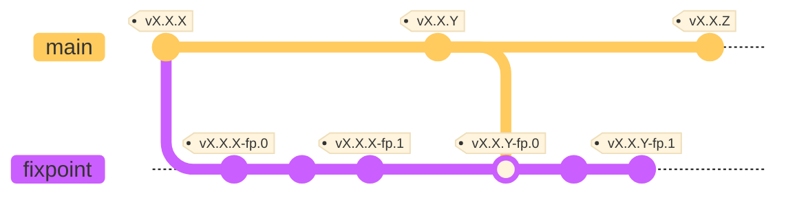

# 社内向け README

公式の [guacd](https://github.com/apache/guacamole-server) のリポジトリのフォークです  
Kroker に同梱する向けのパッチが適用されています

オリジナルの README は[こちら](./README)

## ブランチ運用について

Kroker 向けのバージョン管理のために [`fixpoint`](https://github.com/fixpoint/guacamole-server/tree/fixpoint) ブランチを用意しています  
開発時は `fixpoint` ブランチから分岐させて PR  を作成してください

### バージョン更新時

ベースになる guacd のバージョンを更新する場合は、`fixpoint` ブランチに対象のバージョンタグをマージしてください

```
$ git switch fixpiont
$ git merge X.X.X
```

発生したコンフリクトは適宜解消してください

### リリース時

リリース時には `fixpoint` ブランチ上にタグを切ってください  
タグには、ベースとなった公式のバージョンタグに `-fp.{INDEX}` を追加した名前を使用します

例えば、ベースのバージョンタグが `X.X.X` なら、最初のリリースタグは `X.X.X-fp.0` とし、その後は `X.X.X-fp.1`, `X.X.X-fp.2` ... と続けます  
ベースのバージョンを `X.X.Y` に更新したなら、また `X.X.Y-fp.0` から始めてください

---



